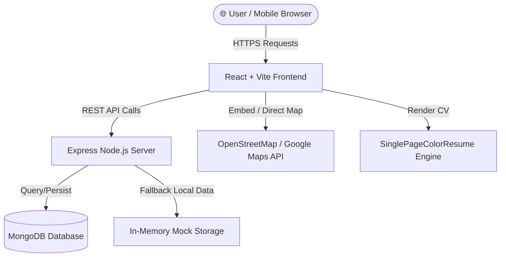

# 🚀 Mrunal Chaudhari —  Portfolio

[](https://react.dev)
[](https://tailwindcss.com)
[](https://expressjs.com)
[](https://mongodb.com)
[](LICENSE)

An enterprise-grade, high-performance personal portfolio and interactive resume platform built for **Mrunal  Chaudhari** (Software Engineer & Full-Stack / AI Developer). Features a responsive dark glassmorphism design system, custom PDF viewing modal, dynamic project showcases, privacy-compliant maps, and RESTful API backend integrations.

---

## 📋 Table of Contents

- [Architectural Overview](#-architectural-overview)
- [Key Features](#-key-features)
- [Directory Structure](#-directory-structure)
- [Technology Stack](#-technology-stack)
- [API Documentation](#-api-documentation)
- [Mobile View & Design System](#-mobile-view--design-system)
- [Quick Start Guide](#-quick-start-guide)
- [Environment Variables](#-environment-variables)
- [Seed Database & Verification](#-seed-database--verification)
- [Contact & Profile Links](#-contact--profile-links)

---

## 🏗️ Architectural Overview

The application follows a decoupled **Client-Server Architecture** with database abstraction layers for MongoDB and automatic fallback handlers for high availability.



---

## ✨ Key Features

1. **Integrated Executive CV & Single-View PDF Engine**
   - Live interactive PDF viewer modal ([PdfViewerModal.jsx](file:///c:/Users/mruna/Downloads/my%20protfliow/client/src/components/PdfViewerModal.jsx)).
   - High-contrast two-column executive resume renderer ([SinglePageColorResume.jsx](file:///c:/Users/mruna/Downloads/my%20protfliow/client/src/components/SinglePageColorResume.jsx)).
   - System PDF downloader and print-to-PDF triggers.

2. **Featured Engineering Projects Showcase**
   - Deep-dive case studies for flagship applications: **ExamForge-AI** and **AI-BOS** ([Projects.jsx](file:///c:/Users/mruna/Downloads/my%20protfliow/client/src/pages/Projects.jsx) & [ProjectDetail.jsx](file:///c:/Users/mruna/Downloads/my%20protfliow/client/src/pages/ProjectDetail.jsx)).
   - Detailed technical stack pills, key feature lists, and architectural breakdowns.

3. **Privacy-Focused Real-Time Location Map**
   - Embedded OpenStreetMap frame preventing browser tracking prevention errors ([Contact.jsx](file:///c:/Users/mruna/Downloads/my%20protfliow/client/src/pages/Contact.jsx)).
   - Direct Google Maps launcher button for instant navigation.

4. **Persisted Contact Inquiry Portal**
   - Real-time client form validation with custom toast notification ([CelebrationToast.jsx](file:///c:/Users/mruna/Downloads/my%20protfliow/client/src/components/CelebrationToast.jsx)).
   - API endpoints storing inquiries in MongoDB.

5. **100% Mobile Responsive Design System**
   - Fully optimized mobile navigation drawer ([Navbar.jsx](file:///c:/Users/mruna/Downloads/my%20protfliow/client/src/components/Navbar.jsx)).
   - Responsive touch layout across all screen breakpoints (320px to 4K displays).

---

## 📂 Directory Structure

```text
my-portfolio/
├── client/                        # React Frontend Application
│   ├── public/                    # Static Assets (Profile image, Resume PDF)
│   ├── src/
│   │   ├── api/                   # API Client & Axios / Fetch wrapper
│   │   ├── components/            # Reusable UI Components
│   │   │   ├── AnimatedAvatar.jsx # Avatar with ambient glowing rings
│   │   │   ├── Background3D.jsx   # Interactive canvas background particles
│   │   │   ├── CelebrationToast.jsx# Notification toast component
│   │   │   ├── Footer.jsx         # Portfolio footer component
│   │   │   ├── Layout.jsx         # Main router layout wrapper
│   │   │   ├── Navbar.jsx         # Responsive navbar with drawer
│   │   │   ├── PdfViewerModal.jsx # Single-page PDF viewer modal
│   │   │   └── SinglePageColorResume.jsx # High-contrast CV generator
│   │   ├── pages/                 # Main Application Views
│   │   │   ├── Home.jsx           # Hero & highlights
│   │   │   ├── About.jsx          # Profile, impact metrics & skill matrix
│   │   │   ├── Experience.jsx     # Career timeline & technical achievements
│   │   │   ├── Projects.jsx       # Portfolio project gallery
│   │   │   ├── ProjectDetail.jsx  # In-depth architectural case studies
│   │   │   ├── Blog.jsx           # Relatable technical articles & CRUD
│   │   │   ├── BlogDetail.jsx     # Markdown-formatted article view
│   │   │   ├── Resume.jsx         # Full interactive resume & CRUD mode
│   │   │   └── Contact.jsx        # Direct message form & location map
│   │   ├── App.jsx                # Application routes
│   │   ├── main.jsx               # Vite React DOM entrypoint
│   │   └── index.css              # Tailwind CSS styles
│   └── package.json
│
├── server/                        # Node.js & Express REST Backend
│   ├── models/                    # Mongoose Data Schemas
│   ├── routes/                    # API Route Handlers
│   ├── db.js                      # MongoDB connection & fallback setup
│   ├── index.js                   # Server entrypoint
│   └── seed.js                    # Database seed script
│
├── package.json                   # Monorepo root scripts
└── README.md                      # Project Documentation
```

---

## ⚡ Technology Stack

### Frontend
- **Framework:** React 18, React Router v6
- **Build Tool:** Vite v6
- **Styling:** Tailwind CSS v3.4, Framer Motion
- **Icons & Visuals:** HTML5 Canvas, Google Fonts (Inter / Mono)

### Backend
- **Runtime:** Node.js v18+
- **Framework:** Express.js
- **Database:** MongoDB & Mongoose (with in-memory fallback adapter)
- **Middleware:** CORS, Express JSON Parser

---

## 📡 API Documentation

| Endpoint | Method | Description | Request Body Example |
| :--- | :--- | :--- | :--- |
| `/api/resume` | `GET` | Retrieve complete resume dataset (profile, skills, experience, projects, education) | N/A |
| `/api/contact` | `POST` | Submit direct contact inquiry | `{ "name": "Name", "email": "email@domain.com", "message": "Inquiry..." }` |
| `/api/projects` | `GET` | Fetch list of portfolio projects | N/A |
| `/api/projects` | `POST` | Add project entry to database | `{ "name": "Project Name", "stack": ["React", "FastAPI"] }` |
| `/api/blogs` | `GET` | Retrieve blog posts & technical articles | N/A |
| `/api/blogs` | `POST` | Publish new blog post | `{ "title": "Article Title", "content": "Markdown text..." }` |

---

## 📱 Mobile View & Design System

The platform features a **Dark Gold / Amber Aesthetics Design System**:

- **Color Palette:** Slate-950 (`#020617`), Slate-900 (`#0f172a`), Amber-400 (`#f59e0b`), Emerald-400 (`#34d399`).
- **Typography:** Monospace accent badges (`font-mono`) paired with black sans-serif headings (`font-black`).
- **Breakpoints:** Tested for iPhone SE (375px), Pixel 7 (412px), iPad Air (820px), and Desktop (1440px+).

---

## ⚙️ Quick Start Guide

### Prerequisites
- Node.js v18.0.0 or higher
- npm v9.0.0 or higher
- MongoDB instance (optional; server operates seamlessly in fallback mode if MongoDB is unavailable)

### 1. Installation

Clone the repository and install all dependencies:

```bash
# Clone the repository
git remote add origin https://github.com/PlatonicM/my-portfolio.git

# Navigate into project folder
cd my-portfolio

# Install monorepo dependencies
npm run install:all
```

### 2. Development Mode

Launch both client and server concurrently:

```bash
npm run dev
```

- **Client App:** [http://localhost:5173](http://localhost:5173)
- **Express API:** [http://localhost:5000](http://localhost:5000)

### 3. Production Build

```bash
npm run build --prefix client
```

---

## 🔑 Environment Variables

Create a `.env` file inside the `server/` directory:

```env
PORT=5000
MONGODB_URI=mongodb://localhost:27017/portfolio
NODE_ENV=production
```

---

## 🌱  Database & Verification

To populate MongoDB with initial blog posts and resume data:

```bash
npm run seed --prefix server
```

Run frontend build verification:

```bash
npm run build --prefix client
```

---

## 📬 Contact & Profile Links

- **Name:** Mrunal Chaudhari
- **Role:** Software Engineer | Full-Stack & AI Developer
- **Location:** Nagpur, Maharashtra, India
- **Email:** [mrunalchaudhari666@gmail.com](mailto:mrunalchaudhari666@gmail.com)
- **Phone:** [+91 7030087366](tel:+917030087366)
- **LinkedIn:** [linkedin.com/in/mrunal-chaudhari03](https://linkedin.com/in/mrunal-chaudhari03)
- **GitHub:** [github.com/PlatonicM](https://github.com/PlatonicM)

---

*Engineered with MERN STACK.*